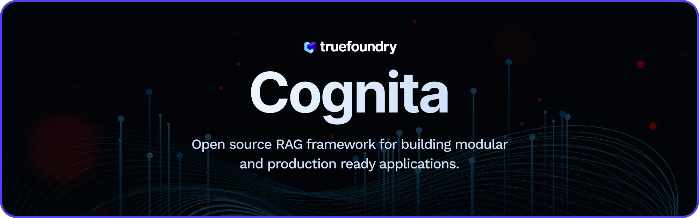
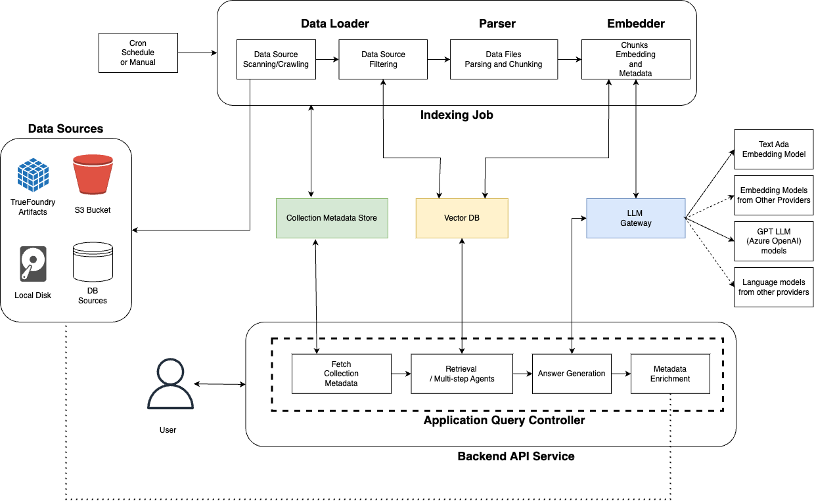
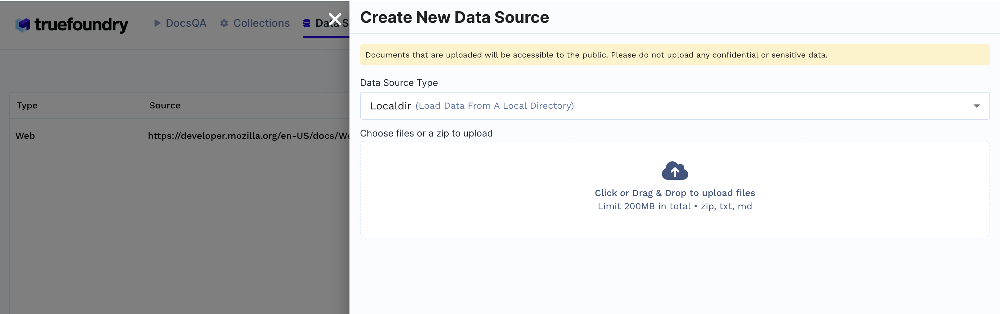
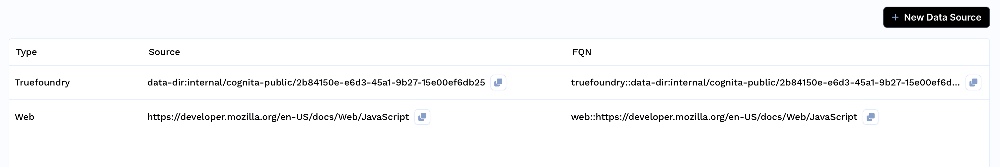
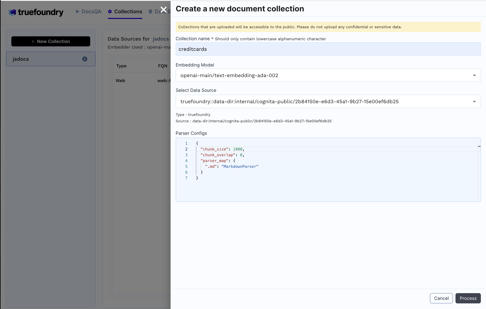
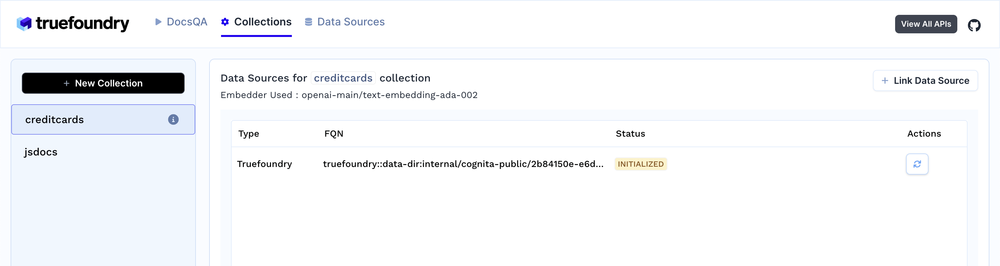
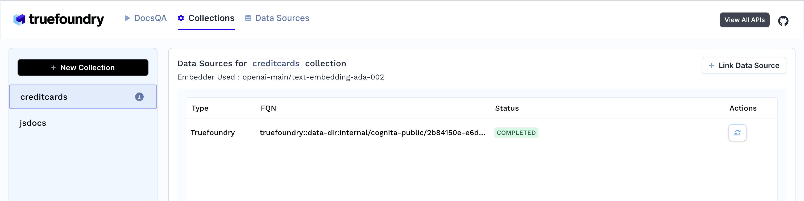
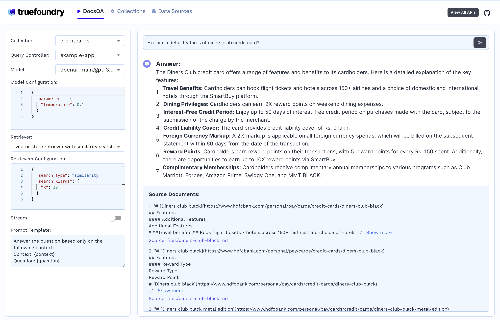

# [Cognita](<(https://cognita.truefoundry.com)>)



## Why use Cognita?

Langchain/LlamaIndex provide easy to use abstractions that can be used for quick experimentation and prototyping on jupyter notebooks. But, when things move to production, there are constraints like the components should be modular, easily scalable and extendable. This is where Cognita comes in action.
Cognita uses Langchain/Llamaindex under the hood and provides an organisation to your codebase, where each of the RAG component is modular, API driven and easily extendible. Cognita can be used easily in a [local](#rocket-quickstart-running-cognita-locally) setup, at the same time, offers you a production ready environment along with no-code [UI](./frontend/README.md) support. Cognita also supports incremental indexing by default.

You can try out Cognita at: [https://cognita.truefoundry.com](https://cognita.truefoundry.com)


# Contents

-   [Cognita](#cognita)
    -   [Introduction](#introduction)
        -   [Advantages of using Cognita are:](#advantages-of-using-cognita-are)
-   ✨ [Getting Started](#sparkles-getting-started)
-   🐍 [Installing Python and Setting Up a Virtual Environment](#snake-installing-python-and-setting-up-a-virtual-environment)
    -   [Setting Up a Virtual Environment](#setting-up-a-virtual-environment)
        -   [Create a Virtual Environment:](#create-a-virtual-environment)
        -   [Activate the Virtual Environment:](#activate-the-virtual-environment)
-   🚀 [Quickstart: Running Cognita Locally](#rocket-quickstart-running-cognita-locally)
    -   [Install necessary packages:](#install-necessary-packages)
    -   [Setting up .env file:](#setting-up-env-file)
    -   [Executing the Code:](#executing-the-code)
-   🛠️ [Project Architecture](#hammer_and_pick-project-architecture)
    -   [Cognita Components:](#cognita-components)
    -   [Data Indexing:](#data-indexing)
    -   ❓[Question-Answering using API Server:](#question-question-answering-using-api-server)
    -   💻 [Code Structure:](#computer-code-structure)
    -   [Customizing the Code for your usecase](#customizing-the-code-for-your-usecase)
        -   [Customizing Dataloaders:](#customizing-dataloaders)
        -   [Customizing Embedder:](#customizing-embedder)
        -   [Customizing Parsers:](#customizing-parsers)
        -   [Adding Custom VectorDB:](#adding-custom-vectordb)
        -   [Rerankers:](#rerankers)
-   💡 [Writing your Query Controller (QnA):](#bulb-writing-your-query-controller-qna)
    -   [Steps to add your custom Query Controller:](#steps-to-add-your-custom-query-controller)
-   🐳 [Quickstart: Deployment with Truefoundry:](#whale-quickstart-deployment-with-truefoundry)
    -   [Using RAG UI](#using-the-rag-ui)
-   💖 [Open Source Contribution](#sparkling_heart-open-source-contribution)
-   🔮 [Future developments](#crystal_ball-future-developments)

## Introduction

Cognita is an open-source framework to organize your RAG codebase along with a frontend to play around with different RAG customizations. It provides a simple way to organize your codebase so that it becomes easy to test it locally while also being able to deploy it in a production ready environment. The key issues that arise while productionizing RAG system from a Jupyter Notebook are:

1. **Chunking and Embedding Job**: The chunking and embedding code usually needs to be abstracted out and deployed as a job. Sometimes the job will need to run on a schedule or be triggered via an event to keep the data updated.
2. **Query Service**: The code that generates the answer from the query needs to be wrapped up in a api server like FastAPI and should be deployed as a service. This service should be able to handle multiple queries at the same time and also autoscale with higher traffic.
3. **LLM / Embedding Model Deployment**: Often times, if we are using open-source models, we load the model in the Jupyter notebook. This will need to be hosted as a separate service in production and model will need to be called as an API.
4. **Vector DB deployment**: Most testing happens on vector DBs in memory or on disk. However, in production, the DBs need to be deployed in a more scalable and reliable way.

Cognita makes it really easy to customize and experiment everything about a RAG system and still be able to deploy it in a good way. It also ships with a UI that makes it easier to try out different RAG configurations and see the results in real time. You can use it locally or with/without using any Truefoundry components. However, using Truefoundry components makes it easier to test different models and deploy the system in a scalable way. Cognita allows you to host multiple RAG systems using one app.

### Advantages of using Cognita are:

1. A central reusable repository of parsers, loaders, embedders and retrievers.
2. Ability for non-technical users to play with UI - Upload documents and perform QnA using modules built by the development team.
3. Fully API driven - which allows integration with other systems.
    > If you use Cognita with Truefoundry AI Gateway, you can get logging, metrics and feedback mechanism for your user queries.

### Features:

1. Support for multiple document retrievers that use `Similarity Search`, `Query Decompostion`, `Document Reranking`, etc
1. Support for SOTA OpenSource embeddings and reranking from `mixedbread-ai`
1. Support for using LLMs using `Ollama`
1. Support for incremental indexing that ingests entire documents in batches (reduces compute burden), keeps track of already indexed documents and prevents re-indexing of those docs.

# :sparkles: Getting Started

You can play around with the code locally using the python [script](#rocket-quickstart-running-cognita-locally) or using the UI component that ships with the code.

# :snake: Installing Python and Setting Up a Virtual Environment

Before you can use Cognita, you'll need to ensure that `Python >=3.10.0` is installed on your system and that you can create a virtual environment for a safer and cleaner project setup.

## Setting Up a Virtual Environment

It's recommended to use a virtual environment to avoid conflicts with other projects or system-wide Python packages.

### Create a Virtual Environment:

Navigate to your project's directory in the terminal.
Run the following command to create a virtual environment named venv (you can name it anything you like):

```
python3 -m venv ./venv
```

### Activate the Virtual Environment:

-   On Windows, activate the virtual environment by running:

```
venv\Scripts\activate.bat
```

-   On macOS and Linux, activate it with:

```
source venv/bin/activate
```

Once your virtual environment is activated, you'll see its name in the terminal prompt. Now you're ready to install Cognita using the steps provided in the Quickstart sections.

> Remember to deactivate the virtual environment when you're done working with Cognita by simply running deactivate in the terminal.

# :rocket: Quickstart: Running Cognita Locally

Following are the instructions for running Cognita locally without any additional Truefoundry dependencies

## Install necessary packages:

In the project root execute the following command:

```
pip install -r backend/requirements.txt -r backend/additional.requirements.txt
```

## Setting up .env file:

-   Create a `.env` file by copying copy from `env.local.example` set up relavant fields.

## Executing the Code:

-   Now we index the data (`sample-data/creditcards`) by executing the following command from project root:
    ```
    python -m local.ingest
    ```
-   To run the query execute the following command from project root:
    ```
    python -m local.run
    ```

> These commands make use of `local.metadata.yaml` file where you setup qdrant collection name, different data source path, and embedder configurations.

> You can try out different retrievers and queries by importing them from `from backend.modules.query_controllers.example.payload` in `run.py`

> You can also start a FastAPI server: `uvicorn --host 0.0.0.0 --port 8000 backend.server.app:app --reload` Then, Swagger doc will be available at: `http://localhost:8000/` For local version you need not create data sources, collection or index them using API, as it is taken care by `local.metadata.yaml` and `ingest.py` file. You can directly try out retrievers endpoint.

> To use frontend UI for quering you can go to : `cd fronend` and execute `yarn dev` to start the UI and play around. Refer more at frontend [README](./frontend/README.md)

# :hammer_and_pick: Project Architecture



Overall the architecture of Cognita is composed of several entities

## Cognita Components:

1. **Data Sources** - These are the places that contain your documents to be indexed. Usually these are S3 buckets, databases, TrueFoundry Artifacts or even local disk

2. **Metadata Store** - This store contains metadata about the collection themselves. A collection refers to a set of documents from one or more data sources combined. For each collection, the collection metadata stores

    - Name of the collection
    - Name of the associated Vector DB collection
    - Linked Data Sources
    - Parsing Configuration for each data source
    - Embedding Model and Configuration to be used

3. **LLM Gateway** - This is a central proxy that allows proxying requests to various Embedding and LLM models across many providers with a unified API format. This can be OpenAIChat, OllamaChat, or even TruefoundryChat that uses TF LLM Gateway.

4. **Vector DB** - This stores the embeddings and metadata for parsed files for the collection. It can be queried to get similar chunks or exact matches based on filters. We are currently supporting `Qdrant` and `SingleStore` as our choice of vector database.

5. **Indexing Job** - This is an asynchronous Job responsible for orchestrating the indexing flow. Indexing can be started manually or run regularly on a cron schedule. It will

    - Scan the Data Sources to get list of documents
    - Check the Vector DB state to filter out unchanged documents
    - Downloads and parses files to create smaller chunks with associated metadata
    - Embeds those chunks using the AI Gateway and puts them into Vector DB
        > The source code for this is in the `backend/indexer/`

6. **API Server** - This component processes the user query to generate answers with references synchronously. Each application has full control over the retrieval and answer process. Broadly speaking, when a user sends a request

    - The corresponsing Query Controller bootstraps retrievers or multi-step agents according to configuration.
    - User's question is processed and embedded using the AI Gateway.
    - One or more retrievers interact with the Vector DB to fetch relevant chunks and metadata.
    - A final answer is formed by using a LLM via the AI Gateway.
    - Metadata for relevant documents fetched during the process can be optionally enriched. E.g. adding presigned URLs.
        > The code for this component is in `backend/server/`

## Data Indexing:

1. A Cron on some schedule will trigger the Indexing Job
1. The data source associated with the collection are **scanned** for all data points (files)
1. The job compares the VectorDB state with data source state to figure out **newly added files, updated files and deleted files**. The new and updated files are **downloaded**
1. The newly added files and updated files are **parsed and chunked** into smaller pieces each with their own metadata
1. The chunks are **embedded** using embedding models like `text-ada-002` from `openai` or `mxbai-embed-large-v1` from `mixedbread-ai`
1. The embedded chunks are put into VectorDB with auto generated and provided metadata

## :question: Question-Answering using API Server:

1. Users sends a request with their query

2. It is routed to one of the app's query controller

3. One or more retrievers are constructed on top of the Vector DB

4. Then a Question Answering chain / agent is constructed. It embeds the user query and fetches similar chunks.

5. A single shot Question Answering chain just generates an answer given similar chunks. An agent can do multi step reasoning and use many tools before arriving at an answer. In both cases, the API server uses LLM models (like GPT 3.5, GPT 4, etc)

6. Before returning the answer, the metadata for relevant chunks can be updated with things like presigned urls, surrounding slides, external data source links.

7. The answer and relevant document chunks are returned in response.

    **Note:** In case of agents the intermediate steps can also be streamed. It is up to the specific app to decide.

## :computer: Code Structure:

Entire codebase lives in `backend/`

```
.
|-- Dockerfile
|-- README.md
|-- __init__.py
|-- backend/
|   |-- indexer/
|   |   |-- __init__.py
|   |   |-- indexer.py
|   |   |-- main.py
|   |   `-- types.py
|   |-- modules/
|   |   |-- __init__.py
|   |   |-- dataloaders/
|   |   |   |-- __init__.py
|   |   |   |-- loader.py
|   |   |   |-- localdirloader.py
|   |   |   `-- ...
|   |   |-- embedder/
|   |   |   |-- __init__.py
|   |   |   |-- embedder.py
|   |   |   -- mixbread_embedder.py
|   |   |   `-- embedding.requirements.txt
|   |   |-- metadata_store/
|   |   |   |-- base.py
|   |   |   |-- client.py
|   |   |   `-- truefoundry.py
|   |   |-- parsers/
|   |   |   |-- __init__.py
|   |   |   |-- parser.py
|   |   |   |-- pdfparser_fast.py
|   |   |   `-- ...
|   |   |-- query_controllers/
|   |   |   |-- default/
|   |   |   |   |-- controller.py
|   |   |   |   `-- types.py
|   |   |   |-- query_controller.py
|   |   |-- reranker/
|   |   |   |-- mxbai_reranker.py
|   |   |   |-- reranker.requirements.txt
|   |   |   `-- ...
|   |   `-- vector_db/
|   |       |-- __init__.py
|   |       |-- base.py
|   |       |-- qdrant.py
|   |       `-- ...
|   |-- requirements.txt
|   |-- server/
|   |   |-- __init__.py
|   |   |-- app.py
|   |   |-- decorators.py
|   |   |-- routers/
|   |   `-- services/
|   |-- settings.py
|   |-- types.py
|   `-- utils.py
```

## Customizing the Code for your usecase

Cognita goes by the tagline -

> Everything is available and Everything is customizable.

Cognita makes it really easy to switch between parsers, loaders, models and retrievers.

### Customizing Dataloaders:

-   You can write your own data loader by inherting the `BaseDataLoader` class from `backend/modules/dataloaders/loader.py`

-   Finally, register the loader in `backend/modules/dataloaders/__init__.py`

-   Testing a dataloader on localdir, in root dir, copy the following code as `test.py` and execute it. We show how to test an existing `LocalDirLoader` here:

    ```python
    from backend.modules.dataloaders import LocalDirLoader
    from backend.types import DataSource

    data_source = DataSource(
    type="local",
    uri="sample-data/creditcards",
    )

    loader = LocalDirLoader()


    loaded_data_pts = loader.load_full_data(
        data_source=data_source,
        dest_dir="test/creditcards",
    )


    for data_pt in loaded_data_pts:
        print(data_pt)
    ```

### Customizing Embedder:

-   The codebase currently uses `OpenAIEmbeddings` you can registered as `default`.
-   You can register your custom embeddings in `backend/modules/embedder/__init__.py`
-   You can also add your own embedder an example of which is given under `backend/modules/embedder/mixbread_embedder.py`. It inherits langchain embedding class.

### Customizing Parsers:

-   You can write your own parser by inherting the `BaseParser` class from `backend/modules/parsers/parser.py`

-   Finally, register the parser in `backend/modules/parsers/__init__.py`

-   Testing a Parser on a local file, in root dir, copy the following code as `test.py` and execute it. Here we show how we can test existing `MarkdownParser`:

    ```python
    import asyncio
    from backend.modules.parsers import MarkdownParser

    parser = MarkdownParser()
    chunks =  asyncio.run(
        parser.get_chunks(
            filepath="sample-data/creditcards/diners-club-black.md",
        )
    )
    print(chunks)
    ```

### Adding Custom VectorDB:

-   To add your own interface for a VectorDB you can inhertit `BaseVectorDB` from `backend/modules/vector_db/base.py`

-   Register the vectordb under `backend/modules/vector_db/__init__.py`

### Rerankers:

-   Rerankers are used to sort relavant documents such that top k docs can be used as context effectively reducing the context and prompt in general.
-   Sample reranker is written under `backend/modules/reranker/mxbai_reranker.py`

# :bulb: Writing your Query Controller (QnA):

Code responsible for implementing the Query interface of RAG application. The methods defined in these query controllers are added routes to your FastAPI server.

## Steps to add your custom Query Controller:

-   Add your Query controller class in `backend/modules/query_controllers/`

-   Add `query_controller` decorator to your class and pass the name of your custom controller as argument

```controller.py
from backend.server.decorator import query_controller

@query_controller("/my-controller")
class MyCustomController():
    ...
```

-   Add methods to this controller as per your needs and use our http decorators like `post, get, delete` to make your methods an API

```controller.py
from backend.server.decorator import post

@query_controller("/my-controller")
class MyCustomController():
    ...

    @post("/answer")
    def answer(query: str):
        # Write code to express your logic for answer
        # This API will be exposed as POST /my-controller/answer
        ...
```

-   Import your custom controller class at `backend/modules/query_controllers/__init__.py`

```__init__.py
...
from backend.modules.query_controllers.sample_controller.controller import MyCustomController
```

> As an example, we have implemented sample controller in `backend/modules/query_controllers/example`. Please refer for better understanding

# :whale: Quickstart: Deployment with Truefoundry:

To be able to **Query** on your own documents, follow the steps below:

1.  Register at TrueFoundry, follow [here](https://www.truefoundry.com/register)

    -   Fill up the form and register as an organization (let's say <org_name>)
    -   On `Submit`, you will be redirected to your dashboard endpoint ie https://<org_name>.truefoundry.cloud
    -   Complete your email verification
    -   Login to the platform at your dashboard endpoint ie. https://<org_name>.truefoundry.cloud

    `Note: Keep your dashboard endpoint handy, we will refer it as "TFY_HOST" and it should have structure like "https://<org_name>.truefoundry.cloud"`

2.  Setup a cluster, use TrueFoundry managed for quick setup

    -   Give a unique name to your **[Cluster](https://docs.truefoundry.com/docs/workspace)** and click on **Launch Cluster**
    -   It will take few minutes to provision a cluster for you
    -   On **Configure Host Domain** section, click `Register` for the pre-filled IP
    -   Next, `Add` a **Docker Registry** to push your docker images to.
    -   Next, **Deploy a Model**, you can choose to `Skip` this step

3.  Add a **Storage Integration**

4.  Create a **ML Repo**

    -   Navigate to **ML Repo** tab
    -   Click on `+ New ML Repo` button on top-right
    -   Give a unique name to your **ML Repo** (say 'docs-qa-llm')
    -   Select **Storage Integration**
    -   On `Submit`, your **ML Repo** will be created

        For more details: [link](https://docs.truefoundry.com/docs/creating-ml-repo-via-ui)

5.  Create a **Workspace**

    -   Navigate to **Workspace** tab
    -   Click on `+ New Workspace` button on top-right
    -   Select your **Cluster**
    -   Give a name to your **Workspace** (say 'docs-qa-llm')
    -   Enable **ML Repo Access** and `Add ML Repo Access`
    -   Select your **ML Repo** and role as **Project Admin**
    -   On `Submit`, a new **Workspace** will be created. You can copy the **Workspace FQN** by clicking on **FQN**.

    For more details: [link](https://docs.truefoundry.com/docs/installation-and-setup#5-creating-workspaces)

6.  Deploy **RAG Application**

    -   Navigate to **Deployments** tab
    -   Click on `+ New Deployment` buttton on top-right
    -   Select `Application Catalogue`
    -   Select your workspace
    -   Select RAG Application
    -   Fill up the deployment template
        -   Give your deployment a Name
        -   Add ML Repo
        -   You can either add an existing Qdrant DB or create a new one
        -   By default, `main` branch is used for deployment (You will find this option in `Show Advance fields`). You can change the branch name and git repository if required.
            > Make sure to re-select the main branch, as the SHA commit, does not get updated automatically.
        -   Click on `Submit` your application will be deployed.

## Using the **RAG UI**:

The following steps will showcase how to use the cognita UI to query documents:

1.  Create Data Source

    -   Click on `Data Sources` tab
        
    -   Click `+ New Datasource`
    -   Data source type can be either files from local directory, web url, github url or providing Truefoundry artifact FQN.
        -   E.g: If `Localdir` is selected upload files from your machine and click `Submit`.
    -   Created Data sources list will be available in the Data Sources tab.
        

2.  Create Collection

    -   Click on `Collections` tab
    -   Click `+ New Collection`
        
    -   Enter Collection Name
    -   Select Embedding Model
    -   Add earlier created data source and the necessary configuration
    -   Click `Process` to create the collection and index the data.
        

3.  As soon as you create the collection, data ingestion begins, you can view it's status by selecting your collection in collections tab. You can also add additional data sources later on and index them in the collection.
    

4.  Response generation
    

    -   Select the collection
    -   Select the LLM and it's configuration
    -   Select the document retriever
    -   Write the prompt or use the default prompt
    -   Ask the query

# :sparkling_heart: Open Source Contribution

Your contributions are always welcome! Feel free to contribute ideas, feedback, or create issues and bug reports if you find any! Before contributing, please read the [Contribution Guide](./CONTRIBUTIONGUIDE.md).

# :crystal_ball: Future developments

Contributions are welcomed for the following upcoming developments:

-   Support for other vector databases like `Chroma`, `Weaviate`, etc
-   Support for `Scalar + Binary Quantization` embeddings.
-   Support for `RAG Evalutaion` of different retrievers.
-   Support for `RAG Visualization`.
-   Support for conversational chatbot with context
-   Support for RAG optimized LLMs like `stable-lm-3b`, `dragon-yi-6b`, etc
-   Support for `GraphDB`

---

# Star History

[](https://star-history.com/#truefoundry/cognita&Date)
