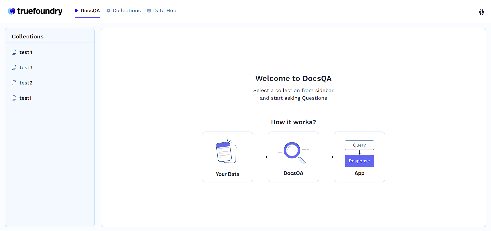
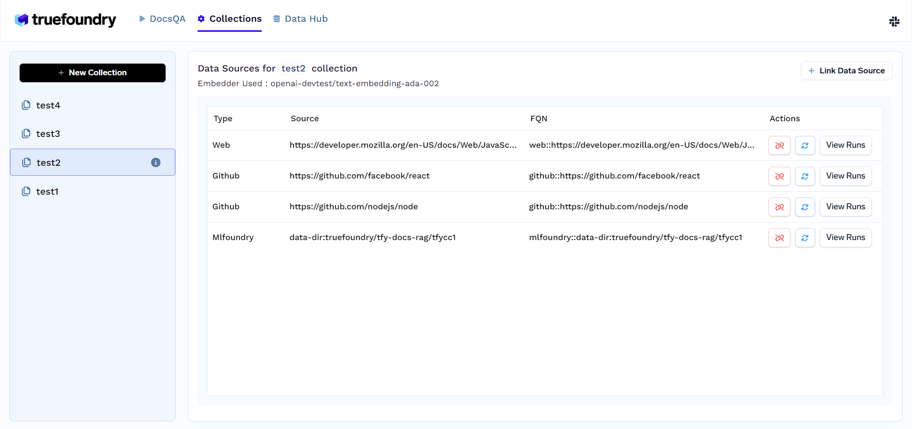
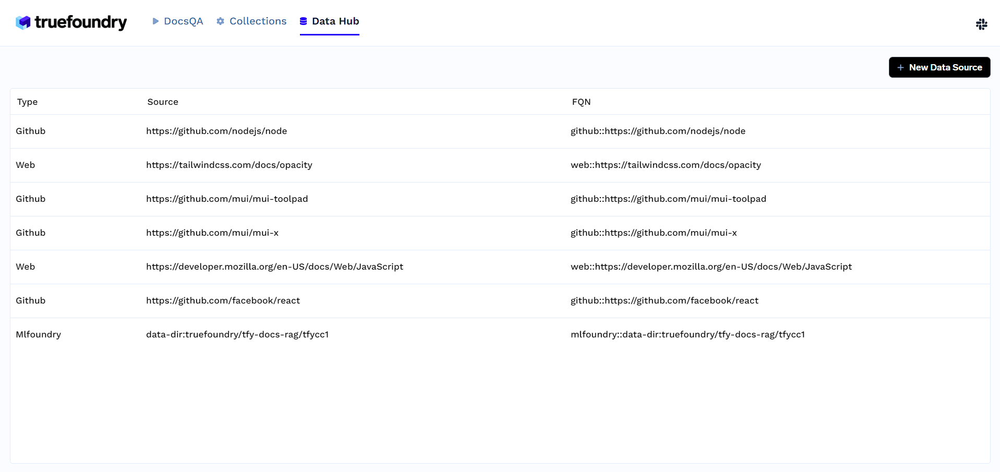

# Docs QA Frontend

## Environment Setup

### Prerequisites

Before you begin, ensure you have the following installed on your machine:

1. [Node.js](https://nodejs.org/) - v18

- For Windows users, you can download the installer from the [official Node.js website](https://nodejs.org/en/blog/release/v18.12.0).

- For Linux users, you can use the following commands to install Node.js:

```bash
sudo apt-get update
sudo apt-get upgrade

sudo apt-get install software-properties-common

curl -sL https://deb.nodesource.com/setup_18.x | sudo -E bash -

sudo apt-get install nodejs
```

- For macOS users, you can use Homebrew to install Node.js by running the following command in your terminal:

```bash
brew install node@18
```

2. [Yarn](https://yarnpkg.com/) - v1.22.19

- Install Yarn using npm:

```bash
npm install -g yarn@1.22.19
```

### Installation

1. Clone the repository:

```bash
git clone https://github.com/truefoundry/docs-qa-playground.git
```

2. Navigate into the project directory:

```bash
cd docs-qa-playground/frontend
```

3. Install dependencies using Yarn:

```bash
yarn install
```

4. Copy the .env.example file and create a new .env file:

```bash
cp .env.example .env
```

5. Open the .env file and customize the environment variables as needed.

Sample .env file:

```bash
VITE_QA_FOUNDRY_URL=tfy-secret://truefoundry:docs-qa-secrets:QA_FOUNDRY_URL
VITE_DOCS_QA_DELETE_COLLECTIONS=false
VITE_DOCS_QA_STANDALONE_PATH=/
VITE_DOCS_QA_ENABLE_REDIRECT=false
VITE_DOCS_QA_MAX_UPLOAD_SIZE_MB=200
```

#### Here, `tfy-secret://truefoundry:docs-qa-secrets:QA_FOUNDRY_URL` is the Secret FQN for the QA Foundry URL. You can [add secret store](https://docs.truefoundry.com/docs/integrations-secret-store) and use it for adding secrets

## Running the Web App

To run the app locally, execute the following command:

```bash
yarn dev
```

This will start the development server. Open http://localhost:5001 to view it in your browser.

## Building for Production

To build the app for production, run:

```bash
yarn build:prod
```

## Website Routes :

### Home Page :

- URL : http://localhost:5001/
- Description : In this page, users can ask questions and search for the answers by selecting any collection from left panel.



### Collections Page :

- URL : http://localhost:5001/collections
- Description : This page lists all the collections available in the website. The collections can be configured from this route.



### Data Hub Page :

- URL : http://localhost:5001/data-hub
- Description : This page lists all the data hubs available in the website. Also users would be able to add new data source in data hub.


